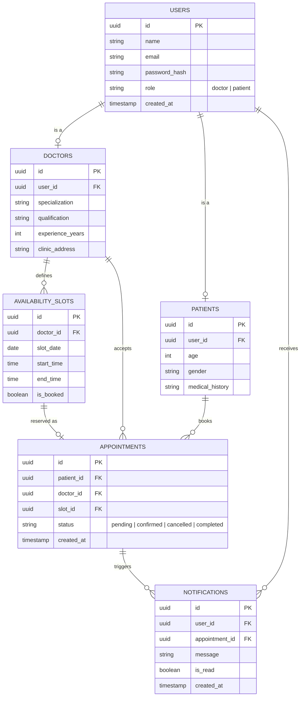

# Schedula — ER Diagram

Entities: `USERS`, `DOCTORS`, `PATIENTS`, `AVAILABILITY_SLOTS`, `APPOINTMENTS`, `NOTIFICATIONS`.

`USERS` is the base identity table (auth/login). `DOCTORS` and `PATIENTS` each hold
a one-to-one `user_id` foreign key back to `USERS`, extending it with role-specific
fields. Doctors define `AVAILABILITY_SLOTS`; a patient books an `APPOINTMENT` against
one doctor and one slot. Every appointment update can trigger a `NOTIFICATION`, which
is also linked back to the user who should receive it.

## Relationship notes

- `USERS` → `DOCTORS` / `PATIENTS`: one-to-one. A single login row expands into a
  role-specific profile, avoiding duplicated auth fields.
- `DOCTORS` → `AVAILABILITY_SLOTS`: one-to-many. A doctor opens many bookable slots.
- `AVAILABILITY_SLOTS` → `APPOINTMENTS`: one-to-one once booked (`is_booked` flips to
  true and the slot is tied to exactly one appointment).
- `PATIENTS` / `DOCTORS` → `APPOINTMENTS`: one-to-many on both sides — a patient can
  hold many appointments over time, and a doctor accepts many appointments.
- `APPOINTMENTS` → `NOTIFICATIONS`: one-to-many. Each state change (booked,
  rescheduled, cancelled, reminder) can spawn its own notification row.
- `USERS` → `NOTIFICATIONS`: one-to-many, since a notification is always addressed
  to a specific user (patient or doctor).
